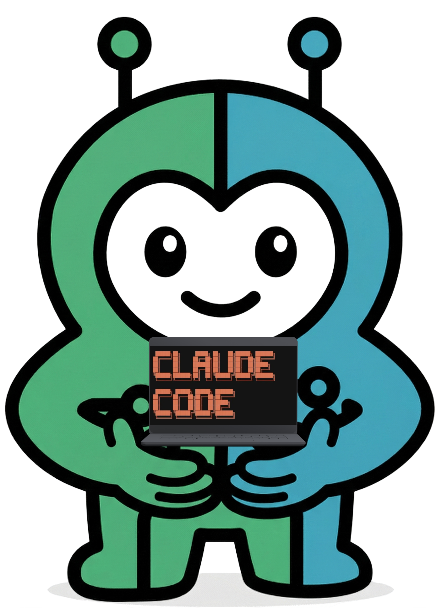

# symbi-claude-code

<p align="center">
  
</p>

One command. Blocks Claude Code from reading your secrets, writing to
sensitive paths, and running destructive shell commands. No runtime
required.

## Install

```
/plugin marketplace add https://github.com/thirdkeyai/symbi-claude-code
```

That's it. The plugin's hooks now fire on every tool call:

- **Reads** of `.env`, `.env.*`, `.ssh/`, `.aws/`, `.gcp/`, `.npmrc`,
  `.pypirc`, `.netrc`, `*.pem`, `*.key`, `id_rsa`/`id_ed25519`/`id_ecdsa`,
  `secrets/`, `credentials/`, `config/database.yml`,
  `config/credentials.json`, `config/master.key` are blocked.
- **Writes** to all of the above, plus `.github/workflows/`, are blocked.
- **Bash** commands matching `rm -rf /`, `rm -rf ~`, `git push --force`,
  `curl ... | sh`, `wget ... | bash`, `chmod 777`, `mkfs*`, `dd if=`, fork
  bombs are blocked. `sudo` is warned (block in strict mode).
- Every tool call is appended to `.symbiont/audit/tool-usage.jsonl` for
  later review.

Read templates (`.env.example`, `.env.sample`, `.env.test`) are exempt.

## Customize

```
/symbi-protect
```

Drops a heavily-commented `.symbiont/local-policy.toml` you can edit.
Add project-specific paths or commands to `[deny]`. List exceptions in
`[allow]`. Switch modes via `[mode]`:

```toml
[mode]
mode = "balanced"       # built-ins active, sudo warns (default)
# mode = "strict"       # built-ins + sudo hard-blocked
# mode = "permissive"   # built-ins disabled, only this file enforced

[deny]
paths    = ["my-private-dir/", "*.backup"]
commands = ["forbidden-cmd"]
branches = ["main", "master"]

[allow]
paths    = [".env.template"]
```

Local rules **extend** the built-ins, not replace them.

## Disable / re-enable

Drop a marker instead of uninstalling:

```
/symbi-disable        # creates .symbiont/disabled — every hook no-ops
/symbi-enable         # removes the marker
```

## Why not just use `settings.json` deny rules?

Hand-rolled `permissions.deny` lists work, but they have known weaknesses:

| Concern              | `settings.json` deny | `symbi-claude-code`            |
| -------------------- | -------------------- | ------------------------------ |
| Bypass via chained shell commands | pattern rules match what you enumerate; reordered or chained commands can slip past variants you didn't list | the full command string is searched, so `true && rm -rf /` still matches `rm -rf /` |
| Pattern upkeep       | enumerated by hand   | structured defaults shipped + extended via TOML |
| Audit trail          | none                 | JSONL per tool call            |
| Read-side protection | tool deny only       | sensitive paths blocked across `Read`/`Write`/`Edit` |
| Override granularity | global               | per-project `[allow]` exceptions |
| Upgrade path         | none                 | drop-in Cedar policy evaluation when `symbi` is installed |

The `symbi-claude-code` hooks treat the command line as a string and search
for deny patterns anywhere in it. They don't try to parse shell syntax —
that's a rabbit hole — but they do match patterns regardless of leading
chain-control tokens.

## Prerequisites

- [Claude Code](https://claude.ai/claude-code).
- `jq` (preferred) or `python3` for hook JSON parsing. The plugin falls
  back to a narrow pure-bash parser if neither is present, with reduced
  fidelity on uncommon escape sequences.

## Slash commands

| Command          | Purpose |
| ---------------- | ------- |
| `/symbi-protect` | Show what's blocked and drop a starter `local-policy.toml` |
| `/symbi-disable` | Drop the kill-switch marker so every hook no-ops |
| `/symbi-enable`  | Remove the kill-switch marker |
| `/symbi-status`  | Health check of plugin + (optional) runtime |
| `/symbi-audit`   | Query and analyze the audit log |

The runtime-aware commands below light up only when the `symbi` binary is
on PATH (see "Going further").

| Command            | Purpose |
| ------------------ | ------- |
| `/symbi-init`      | Scaffold a runtime-managed governed project |
| `/symbi-policy`    | Author, edit, validate Cedar policies |
| `/symbi-verify`    | Verify MCP tool schemas with SchemaPin |
| `/symbi-pin`       | Pin an MCP server's schema (TOFU) |
| `/symbi-dsl`       | Author and validate Symbiont DSL agents |
| `/symbi-agent-sdk` | Generate Claude Agent SDK + ORGA boilerplate |

## Tests

```
bash tests/run-tests.sh
```

Covers the built-in deny defaults, JSON-backend parity (jq / python3 /
bash fallback), chain-bypass resistance, allowlist exemptions, mode
switching, and the kill-switch marker.

---

## Going further: runtime-managed governance

If you install the `symbi` binary, the plugin transparently upgrades:

- **Tier 3 — Cedar evaluation.** When `symbi` is on PATH and the project
  has a `policies/` directory, the policy hook evaluates Cedar policies
  for formal authorization decisions in addition to the built-in checks.
- **MCP tools.** The plugin connects to a `symbi mcp` server exposing
  `invoke_agent`, `list_agents`, `parse_dsl`, `get_agent_dsl`,
  `get_agents_md`, `verify_schema`.
- **SchemaPin verification.** On session start, every server in
  `.mcp.json` is verified; tampered or unsigned servers are surfaced.

Install:

```bash
cargo install symbi
# or
docker pull ghcr.io/thirdkeyai/symbi:latest
```

Or run the included script:

```bash
./install.sh
```

## Dual-mode architecture

### Mode A — Standalone (plugin-first)

Developer installs the plugin into Claude Code. Hooks are advisory unless
a Cedar runtime is also installed. This is what you get from the marketplace
install above.

```
Developer -> Claude Code + symbi plugin -> (optional) symbi mcp
```

### Mode B — ORGA-managed (runtime-first)

Symbiont's `CliExecutor` spawns Claude Code as a governed subprocess. The
plugin detects `SYMBIONT_MANAGED=true` and defers hard enforcement to the
outer ORGA Gate, which cannot be bypassed. Point the plugin at the parent
runtime's MCP endpoint by overriding `.mcp.json`:

```json
{
  "mcpServers": {
    "symbi": { "type": "http", "url": "${SYMBIONT_MCP_URL}" }
  }
}
```

```
Symbiont Runtime (ORGA Loop)
  -> CliExecutor (sandbox + budget enforcement)
    -> Claude Code (with symbi plugin)
      -> Plugin connects back to parent MCP server
```

Best for automated pipelines and enterprise governance. See
`examples/cli-executor/` for a complete setup.

### Mode B environment variables

- `SYMBIONT_MANAGED=true` — signals managed mode
- `SYMBIONT_MCP_URL` — parent runtime's MCP endpoint
- `SYMBIONT_RUNTIME_SOCKET` — Unix socket for runtime communication
- `SYMBIONT_SESSION_ID` — audit log correlation ID
- `SYMBIONT_BUDGET_TOKENS` — token budget for execution
- `SYMBIONT_BUDGET_TIMEOUT` — timeout for execution

## Hooks

| Event         | Script             | Behavior |
| ------------- | ------------------ | -------- |
| SessionStart  | `install-check.sh` | Detects backends, nudges on first session if sensitive files present, runs SchemaPin verification when runtime is installed |
| PreToolUse    | `policy-guard.sh`  | Blocks deny matches with exit code 2 |
| PreToolUse    | `policy-log.sh`    | Advisory slot (currently silent; recording handled by `audit-log.sh`) |
| PostToolUse   | `audit-log.sh`     | Append JSONL line to `.symbiont/audit/tool-usage.jsonl` |

All hooks honor `.symbiont/disabled` (kill switch) and `SYMBIONT_MANAGED`
(Mode B deference).

## File conventions

| Path                          | Purpose |
| ----------------------------- | ------- |
| `.symbiont/local-policy.toml` | Project deny/allow rules (extends built-ins) |
| `.symbiont/disabled`          | Kill-switch marker |
| `.symbiont/audit/`            | Local audit log output |
| `agents/*.dsl`                | (runtime) Agent DSL definitions |
| `policies/*.cedar`            | (runtime) Cedar authorization policies |
| `symbiont.toml`               | (runtime) Symbiont runtime configuration |
| `AGENTS.md`                   | (runtime) Agent manifest |

## Examples

| Directory                | Description |
| ------------------------ | ----------- |
| `examples/standalone/`   | Mode A setup for individual developers |
| `examples/cli-executor/` | Mode B setup with DSL + Cedar policy |
| `examples/agent-sdk/`    | Agent SDK wrapper pattern for headless agents |

## License

Apache 2.0 — see [LICENSE](LICENSE).

## Links

- [Symbiont Documentation](https://docs.symbiont.dev)
- [ThirdKey AI](https://thirdkey.ai)
- [Implementation Roadmap](ROADMAP.md)

## Disclaimer

This project is not affiliated with, endorsed by, or sponsored by Anthropic, PBC.
"Claude" and "Claude Code" are trademarks of Anthropic, PBC.
"Symbiont" and "ThirdKey" are trademarks of ThirdKey AI.
